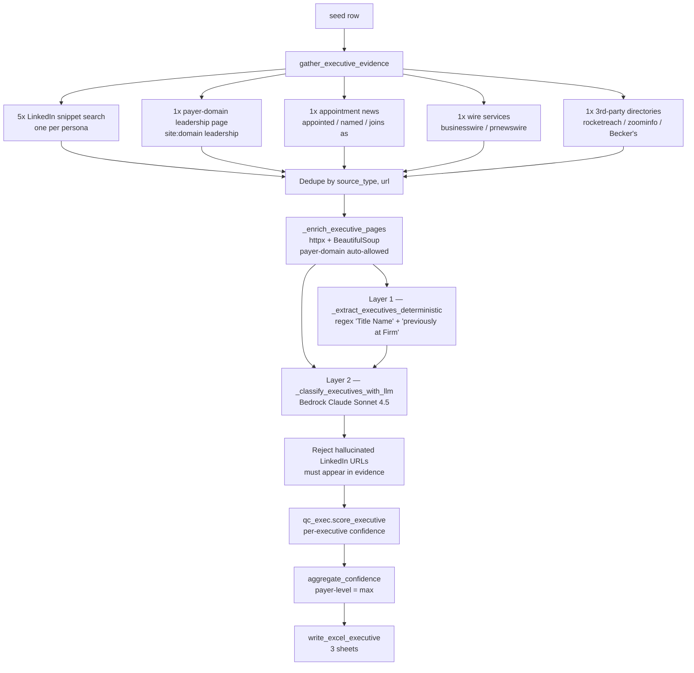

# Payer BD 2 — Executive & Product Intelligence Engine

Two-mode multi-agent pipeline for US health-plan business development:

- **`--mode executive`** *(primary)* — extracts the 5 BD personas (CEO, CIO/CTO, CMO/Growth, Chief Medical, VP Member Experience) per payer, with LinkedIn URLs, past firms, BD notes, and a per-payer confidence score. Output Excel powers a Warm Intro Mapper (which AArete employees previously worked at the same firms as current payer executives).
- **`--mode product`** *(legacy / co-feature)* — scores each payer against **11 Salesforce clouds** (`Yes` / `Likely` / `No` / `Unknown`) with deterministic false-positive guards developed against an internal verification doc.

```
seed CSV  →  [11-agent pipeline]  →  Aarete_BD_Executive_Intelligence_YYYYMMDD.xlsx        (executive mode)
                                  →  Aarete_BD_Salesforce_Payer_Intelligence_YYYYMMDD.xlsx (product mode)
```

---

## Why this exists

BD directors targeting health plans need two things before reaching out:

1. **Who to call** — the 5 buying-center personas, their LinkedIn URLs, and past-firm context for warm intros.
2. **What to lead with** — which technology platforms the payer already runs (cross-sell vs. greenfield).

Manual research takes ~30 min per payer per question and goes stale fast. This pipeline runs each payer in ~60–90 s, grounds every claim in dated source URLs, and emits Excel workbooks the team can ship.

---

## Quick start

```powershell
# 1. Clone
git clone https://github.com/<your-user>/Payer-BD-2.git
cd Payer-BD-2

# 2. Virtualenv + deps
python -m venv .venv
.\.venv\Scripts\Activate.ps1
pip install -r requirements.txt

# 3. Credentials (.env at repo root)
@'
SEARCHAPI_API_KEY=...
AWS_ACCESS_KEY_ID=...
AWS_SECRET_ACCESS_KEY=...
AWS_REGION=us-east-1
BEDROCK_MODEL_ID=anthropic.claude-sonnet-4-5-20250929-v2:0
'@ | Out-File -Encoding utf8 .env

# 4a. Executive mode — quick smoke (~1 payer, ~9 SearchApi calls)
python main.py --mode executive --seed data/seed_payers_smoke.csv --out out/exec

# 4b. Product mode — same engine, different extraction
python main.py --mode product   --seed data/seed_payers_smoke.csv --out out/product

# 5. Open the workbook
ii out/exec/Aarete_BD_Executive_Intelligence_*.xlsx
```

Full 62-payer batches live in [data/seed_payers_62.csv](data/seed_payers_62.csv) (also split into 3 batch files for parallel execution).

### CLI flags

| Flag | Default | Purpose |
| --- | --- | --- |
| `--mode` | `product` | `executive` or `product` |
| `--seed` | `data/seed_payers_smoke.csv` | Input CSV path |
| `--out` | `out` | Output directory |
| `--log-level` | `INFO` | `DEBUG` / `INFO` / `WARNING` |

`main.py` pre-checks SearchApi quota (`7 × seed_count` for product, `9 × seed_count` for executive) and aborts before burning credits if the account is short.

---

## Tech stack

| Layer | Choice |
| --- | --- |
| Language | Python 3.11+ |
| Agent framework | [CrewAI](https://github.com/crewAIInc/crewAI) |
| LLM | AWS Bedrock — Claude Sonnet 4.5 (via `litellm`) |
| Web search | [SearchApi.io](https://www.searchapi.io/) Google / News / Jobs |
| HTML fetch | `httpx` + `BeautifulSoup` |
| Excel | `openpyxl` |
| Test | `pytest`, `respx` |

---

## Executive Intelligence (`--mode executive`)

### The 5 target personas

| Persona | Recognized titles | Why BD needs them |
|---|---|---|
| **CEO / President** | Chief Executive Officer, President, Market President, Plan President | Ultimate budget authority for enterprise transformation |
| **CIO / CTO** | Chief Information Officer, Chief Technology Officer, Chief Digital Officer | Buyer for enterprise technology strategy, CRM modernization, data architecture, digital transformation |
| **CMO / Growth** | Chief Marketing Officer, Chief Growth Officer, VP Sales & Marketing | Buyer for member acquisition, digital marketing transformation, revenue growth |
| **Chief Medical / Clinical** | Chief Medical Officer, Chief Clinical Officer, Chief Population Health Officer | Buyer for care management optimization, population health analytics, clinical operations |
| **VP Member Experience** | Chief Experience Officer, Chief Patient Engagement Officer, VP Member Experience | Buyer for contact-center transformation, member portal strategy, omnichannel engagement |

CMO ambiguity (Chief Marketing vs. Chief Medical) is resolved by the LLM step in [src/payer_intel/crew.py](src/payer_intel/crew.py) (`_classify_executives_with_llm`).

### Pipeline (per payer, ~9 SearchApi calls)



### Confidence scoring (per executive, in [src/payer_intel/qc_exec.py](src/payer_intel/qc_exec.py))

| Tier | Trigger |
|---|---|
| **High** | Official payer leadership page hit AND LinkedIn — *or* recent (≤180 d) press release AND LinkedIn — *or* leadership page alone |
| **Medium** | Active LinkedIn snippet with `Present` tenure — *or* recent appointment press release alone |
| **Low** | Third-party directory only — *or* LinkedIn without current-tenure signal |

Payer-level confidence = `max(High > Medium > Low)` across all identified executives.

### Output workbook (3 sheets, 16 cols per spec)

| Sheet | Purpose | Notable contents |
|---|---|---|
| **Executive Intelligence** | One row per payer | A–B identity · C–L name + LinkedIn for each of 5 personas (em-dash placeholder if missing) · M aggregated past firms · N date verified · O confidence · P BD notes |
| **Coverage Dashboard** | Pivot of role × confidence | Identified vs. missing counts, plus High/Medium/Low breakdown |
| **Past Firms Index** | Flat (firm, exec, role, payer, LinkedIn) | Powers the Warm Intro Mapper UI — "who used to work at McKinsey that is now a buyer at a health plan?" |

LinkedIn cells are clickable `openpyxl` hyperlinks. Confidence column is conditionally color-coded (green / yellow / red).

---

## Product Intelligence (`--mode product`)

Scores each payer against 11 Salesforce clouds via a two-layer classifier:

- **Layer 1 — `_extract_products_from_body`** ([src/payer_intel/crew.py](src/payer_intel/crew.py)) scans enriched page bodies with strict regex + alias-proximity windows. Fast, free, audit-friendly.
- **Layer 2 — `_classify_with_llm`** ([src/payer_intel/crew.py](src/payer_intel/crew.py)) sees only items that survived the URL/body gate, with regex hits surfaced as hints. Handles nuance: employee titles, narrative phrasing, sibling-entity reasoning, former-employee rejection.

Both feed `qc.score`, which applies a strict precedence ladder.

### QC rule ladder ([src/payer_intel/qc.py](src/payer_intel/qc.py))

First match wins.

| # | Trigger | Verdict | Confidence |
|---|---|---|---|
| 1 | Any `case_study` evidence | Yes | High |
| 2 | ≥1 LinkedIn + technographic | Yes | High |
| 3 | ≥1 LinkedIn + recent job (≤365 d) | Yes | High |
| 4 | ≥1 LinkedIn + recent news (≤365 d) | Yes | High |
| 5 | ≥2 distinct LinkedIn URLs | Yes | High |
| 6 | recent job + recent review | Yes | High |
| 7 | recent job + recent news | Yes | High |
| 8 | recent job + technographic | Yes | High |
| 9 | 1 LinkedIn alone | Likely | Medium |
| 10 | recent job alone | Likely | Medium |
| 11 | recent review alone (≤730 d) | Likely | Medium |
| 12 | recent news alone | Likely | Medium |
| 13 | technographic alone | Likely | Medium |
| 14 | Only stale signals | Unknown | Low |
| 15 | No evidence | Unknown | Low |

LinkedIn URLs bypass the recency gate (a profile lives at its URL until edited).

### False-positive guards

| Code | Risk | Enforcing function |
|---|---|---|
| **FP-01** | Salesforce blog mentions payer in unrelated thought-leadership | `_salesforce_blog_lacks_customer_verb` |
| **FP-02** | Salesforce blog category/tag/author/paginated index | `_is_zero_evidence_url` |
| **FP-03** | Bare `my.site.com` (often non-SF tenants) | `_TWO_PASS_PATTERNS[EXPERIENCE_CLOUD]` |
| **FP-04** | Bare `et.com` (ExactTarget tracker pattern) | `_TWO_PASS_PATTERNS[MARKETING_CLOUD]` |
| **FP-05** | LLM bucketing generic CRM into Service Cloud | classifier prompt + post-process audit |
| **FP-06** | SI-partner brochure that never names the payer | `_si_partner_requires_payer_mention` |
| **FP-07** | Paginated blog-root indexes scraped as evidence | `_is_zero_evidence_url` |
| **MS-05** | Sibling-entity contamination (e.g. AmeriHealth Caritas vs. Independence BC) | `_evidence_body_contains_exclude` |

Plus a **former-employee guard** (LinkedIn profiles with explicit past-tense end dates are excluded) and a **narrative override** (a hard "no credible evidence" line in the LLM summary clears any stray LIKELY verdicts).

### Tracked products

`Sales Cloud`, `Service Cloud`, `Experience Cloud`, `Marketing Cloud`, `Marketing Cloud Account Engagement (Pardot)`, `Health Cloud`, `Agentforce for Healthcare`, `Life Sciences Cloud`, `Financial Services Cloud`, `Revenue Cloud (CPQ)`, `Data Cloud`.

---

## Agents

Constructors live in [src/payer_intel/agents.py](src/payer_intel/agents.py). Product mode uses agents 1–11; executive mode adds 4 parallel agents.

### Product agents

| # | Function | Role | Tool |
|---|---|---|---|
| 1 | `orchestrator_agent` | BD Intelligence Orchestrator | — |
| 2 | `target_identification_agent` | Target List Curator | — |
| 3 | `jobs_agent` | Job Posting Analyst | `GoogleJobsTool` |
| 4 | `news_agent` | PR & News Intelligence | `GoogleNewsTool` |
| 5 | `reviews_agent` | Software Review Analyst | `GoogleSearchTool` |
| 6 | `case_study_agent` | Case Study & Partner Researcher | `GoogleSearchTool` |
| 7 | `technographic_agent` | Technographic Fingerprint Analyst | `TechFingerprintTool` |
| 8 | `recency_agent` | Temporal & Recency Auditor | — |
| 9 | `classifier_agent` | Salesforce Product Taxonomy Classifier | Bedrock Claude Sonnet 4.5 |
| 10 | `qc_agent` | Quality Control Analyst | — |
| 11 | `export_agent` | Excel Export Specialist | `openpyxl` |

### Executive agents

| Function | Role | Tool |
|---|---|---|
| `executive_linkedin_agent` | Executive Profile Hunter | `ExecLinkedInSearchTool` |
| `executive_news_agent` | Leadership Change Tracker | `GoogleNewsTool` + `ExecLeadershipPageTool` |
| `executive_third_party_agent` | Directory Cross-Referencer | `ExecThirdPartyDirectoryTool` |
| `executive_classifier_agent` | Executive Name Resolver | Bedrock Claude Sonnet 4.5 |

---

## Seed CSV schema

| Column | Required | Example | Notes |
|---|---|---|---|
| `payer_name` | yes | `Florida Blue` | Canonical name; primary search anchor |
| `domain` | yes | `floridablue.com` | Public web property; fingerprinted in product mode, fetched for `/leadership` in executive mode |
| `payer_type` | yes | `Blues Plan` | `National` / `Blues Plan` / `Regional` / `Medicaid MCO` / `Medicare Advantage` |
| `search_aliases` | no | `Florida Blue\|GuideWell\|BCBS Florida` | Pipe-delimited; OR'd into all search clauses |
| `search_excludes` | no | `AmeriHealth Caritas\|AmeriHealth NJ` | Pipe-delimited sibling entities to reject (MS-05) |

Example row from [data/seed_payers.csv](data/seed_payers.csv):

```csv
Independence Blue Cross,ibx.com,Blues Plan,Independence Blue Cross|IBX|Independence BC,AmeriHealth Caritas|AmeriHealth New Jersey|AmeriHealth NJ
```

---

## Testing

```powershell
# Full suite (~115 tests, no network)
& .\.venv\Scripts\python.exe -m pytest -q

# Live end-to-end smoke (real Bedrock + real SearchApi)
$env:RUN_LIVE_TESTS = "1"
& .\.venv\Scripts\python.exe -m pytest tests/test_smoke_run.py -v
```

Baseline at the time of writing: **115 passed** (excluding two pre-existing files that depend on `respx`; see Troubleshooting).

### Coverage highlights

| File | Covers |
|---|---|
| `test_executive_schema.py` | `ExecutiveRole`, `EXECUTIVE_TITLE_MAP`, `ExecutivePayerRecord.aggregated_past_firms` |
| `test_executive_extractor.py` | Regex Layer 1 — title→role disambiguation (CMO marketing vs. medical), past-firm capture |
| `test_qc_executive.py` | Every confidence tier in `qc_exec.py` |
| `test_export_executive.py` | 16-col layout, LinkedIn hyperlinks, em-dash placeholders, Coverage Dashboard, Past Firms Index |
| `test_executive_smoke.py` | End-to-end executive run with mocked SearchApi + LLM |
| `test_deterministic_extractor.py` | Layer 1 regex + alias-proximity; URL-gating regressions per FP code |
| `test_url_gating.py` | `_is_zero_evidence_url`, SI-partner check, blog verb check, sibling-entity exclude |
| `test_qc_rules.py` | Full product-mode QC ladder including LinkedIn promotion tiers |
| `test_tech_fingerprint.py` | Two-pass FP-03 / FP-04 guards |
| `test_search_api.py` | Relative-date normalizer ("3 days ago" → ISO) |
| `test_crew_aliases.py` | `build_name_clause` / `build_excludes_set` parsing |
| `test_export.py` | Product-mode Excel schema, freeze panes, dashboard sheet |
| `test_page_enricher.py` | httpx fetcher behavior, allowlist enforcement |
| `test_llm_config.py` | Bedrock model id & litellm wiring |
| `test_smoke_run.py` | End-to-end live product run (opt-in via `RUN_LIVE_TESTS=1`) |

---

## Repository layout

```
.
├── main.py                          # CLI entrypoint + quota precheck + --mode dispatch
├── requirements.txt
├── data/
│   ├── seed_payers_smoke.csv        # quick smoke
│   ├── seed_payers.csv              # production sample
│   ├── seed_payers_62.csv           # full 62-payer target list
│   ├── seed_payers_62_batch{1,2,3}.csv
│   └── seed_payers_v6_spot.csv
├── src/payer_intel/
│   ├── agents.py                    # 11 product agents + 4 executive agents
│   ├── crew.py                      # both pipelines: run() + run_executive()
│   ├── crew_tools.py                # CrewAI tool wrappers (incl. 3 executive search tools)
│   ├── llm.py                       # Bedrock + litellm config
│   ├── qc.py                        # product rule-ladder scorer
│   ├── qc_exec.py                   # executive per-persona scorer
│   ├── schema.py                    # Pydantic models, product + executive column orders
│   ├── export.py                    # openpyxl writer for both modes
│   ├── config.py                    # env loader
│   └── tools/
│       ├── fetcher.py               # httpx page-body enricher
│       ├── search_api.py            # SearchApi.io client + retry + relative-date parser
│       └── tech_fingerprint.py      # technographic markers (single + two-pass)
└── tests/                           # pytest suite (115 tests)
```

---

## Troubleshooting

| Symptom | Cause | Fix |
|---|---|---|
| `botocore.exceptions.ClientError: ... AccessDeniedException` | Bedrock model not enabled in your AWS account/region | Enable Claude Sonnet 4.5 in the Bedrock console; verify `AWS_REGION` matches |
| `SearchQuotaExceeded` mid-run | SearchApi credits depleted | Check `https://www.searchapi.io/api/v1/account`; top up or split the batch CSV |
| `UnicodeEncodeError: 'charmap' codec can't encode character` | PowerShell console codepage drops emoji from CrewAI trace logs | Cosmetic; or `[Console]::OutputEncoding = [Text.UTF8Encoding]::new()` |
| `ModuleNotFoundError: No module named 'respx'` collecting `test_search_api.py` / `test_tech_fingerprint.py` | Pre-existing missing dev dep | `pip install respx` or run pytest with `--ignore=tests/test_search_api.py --ignore=tests/test_tech_fingerprint.py` |
| Executive mode returns mostly empty rows for a payer | Leadership page is PDF or JS-rendered | Classifier falls back to LinkedIn snippets → Medium confidence |
| `Dropping fabricated LinkedIn URL` log line | LLM hallucinated a URL not present in any evidence item | Working as intended — guard rejects URLs not seen in source data |
| Empty XLSX row for a product-mode payer | All evidence dropped by URL/body gate | Run with `--log-level INFO` and grep `Pre-classifier gate dropped` |
| `httpx.ConnectTimeout` enriching a body | Target site is slow or geo-blocking | Retried automatically; snippet-only path takes over on persistent failure |
| Past Firms Index has suspicious entries (e.g. retail chains) | Regex `_PAST_FIRM_RE` over-matches "earlier in career at X" phrasing | Known limitation — filter via BD review |

---

## Credits

Built on top of the original Salesforce Payer Intelligence Engine ([amiiiirsaman/Payer_Salesforce](https://github.com/amiiiirsaman/Payer_Salesforce)). Executive intelligence mode added in 2026.

## License

Internal AArete LLC use. Repository is public for transparency only — not licensed for external redistribution or reuse.
